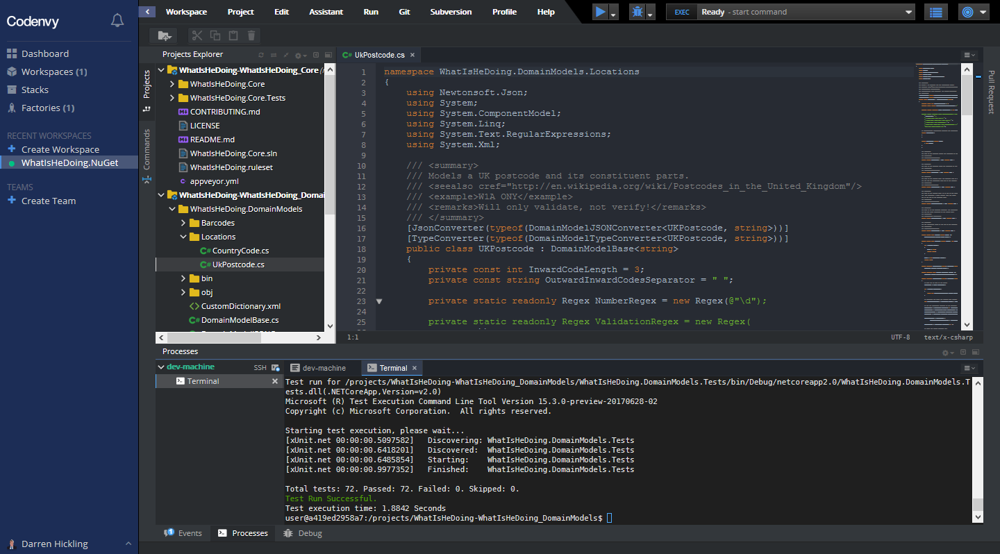

# WhatIsHeDoing.Core

A library of extensions to core .NET functionality.

## Introduction

The core .NET libraries - those that are available on most .NET runtime versions and environments -
are very feature-rich. However, there are times when you need a little helper function, and the list
of those functions slowly grows. Rather than having disparate collections of them, this project seeks
to group them under the `WhatIsHeDoing.Core` namespace, complete with unit tests in the `WhatIsHeDoing.Core.Tests`
project.

## Live Demo

Take a look at the editable code examples at [.NET Fiddle][dotnetfiddle].

## Usage

### Installing

This package is available via [NuGet][nuget], and targets multiple .NET platforms.

### Methods

#### Extensions

##### DateTime

* `GetNextWeekday`: Gets the date at the next weekday supplied.
* `PeriodsBetween`: Generates the periods between two date times.

##### IEnumerable

* `Aggregate`: Aggregate with the index of the current element.
* `IterateJagged`: Flattens a collection of collections of unequal lengths after calling `ZipJagged`.
* `Randomise`: Returns a randomised order of the collection.
* `WhereNotNull`: Filters all null elements from a collection.
* `ZipJagged`: Enables a collection of unequal collection lengths to be iterated together, effectively as columns.

##### Integer

* `ToNearestCeiling`: Rounds to the largest comparison number.

##### Long

* `Length`: Determines the length of a positive number.
* `StripDigits`: Strips a specified number of digits from a number.

##### Object

* `AsFluent`: Calls any action fluently, such as void functions, so that calls can be chained to other
members of object.

##### String

* `AsCurrency`: Formats a string as a currency from the current globalisation.
* `IsTrue`: Determines whether this string can be converted to a boolean and that value is true.
* `Parse`: Invoke a Parse method from the TResult type on the value.
* `ToBytes`: Converts a string representation of a byte array - comma-separated values - to an actual byte array.
* `TryParse`: Tries to invoke a Parse method from the TResult type on the value.

##### Unsigned Long

* `Length`: Determines the length of a number.
* `StripDigits`: Strips a specified number of digits from a number.

## Other Projects

Missing something? Have you tried these excellent projects?

* [Humanizr][humanizr]: Humanizer meets all your .NET needs for manipulating and displaying strings, enums, dates,
times, timespans, numbers and quantities.
* [NodaTime][nodatime]: A better date and time API for .NET.

## Contributing

All contributions are greatly welcomed! Please see the [guidelines][contributing] for more information.

If you are developing locally, pull down this repo and build within Visual Studio (any edition), or
run `dotnet test` on any platform. Alternatively, simply create a new Codenvy workspace from my [factory][codenvy]!

## Authors

* **Darren Hickling**: https://darren.hickling.is/, [@WhatIsDazDoing][whatisdazdoing]

## And Finally...

I'm a huge fan of craft :beers:, so feel free to contribute to more that I can rate on [Untappd][untappd].
Thank you.

[codenvy]: https://codenvy.io/f?name=nuget&user=whatishedoing
[contributing]: CONTRIBUTING.md
[dotnetfiddle]: https://dotnetfiddle.net/xXbTcX "C# Online Compiler | .NET Fiddle"
[humanizr]: http://humanizr.net/
[nodatime]: https://nodatime.org/
[nuget]: https://www.nuget.org/packages/WhatIsHeDoing.Core/
[untappd]: https://untappd.com/user/WhatIsHeDoing
[whatisdazdoing]: https://twitter.com/WhatIsDazDoing "Darren Hickling (@WhatIsDazDoing) | Twitter"
